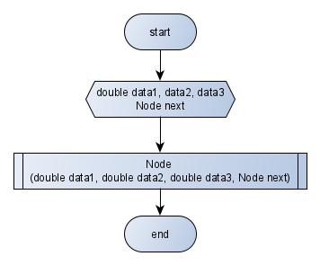
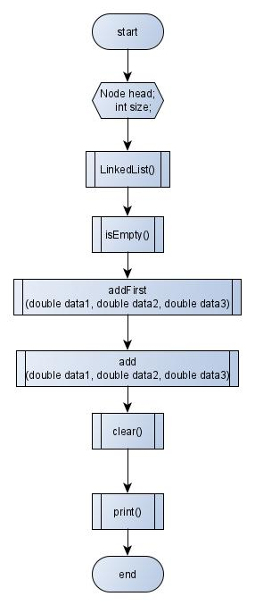
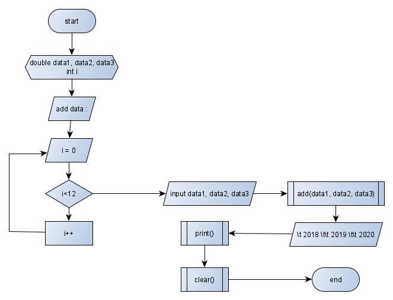

# Laporan

Nama    : Diva Ardhia Rahmania

Nim     : 1941720184

## kode program 
Node :

LinkedList :

Main :

## flowchart 
Node :

fungsi Node :

Linked List:

fungsi linked list :

fungsi isEmpty :

fungsi addFirst :

fungsi add :

fungsi clear :

fungsi print :

main :

## penjelasan
saya menggunakan linked list yang menginputkan data melalui output dan kemudian menggunakan method print() untuk menjadikan output seperti yang dicontohkan di pdf

